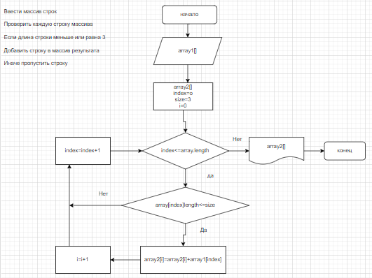

## Контрольная:

1. Создать репозиторий на GitHub.
2. Нарисовать блок-схему алгоритма 
3. Снабдить репозиторий оформленным текстовым описанием решения (файл README.md)
4. Написать программу, решающую поставленную задачу
5. Использовать контроль версий в работе над этим небольшим проектом (не должно быть так что все залито одним коммитом, как минимум этапы 2, 3 и 4 должны быть расположены в разных коммитах)

## Задача: 

Написать программу, которая из имеющегося массива строк формирует массив из строк, длина которых меньше либо равна 3 символа. Первоначальный массив можно ввести с клавиатуры, либо задать на старте выполнения алгоритма. При решении не рекомендуется пользоваться коллекциями, лучше обойтись исключительно массивами.

## Пример:
["hello", "2", "world", ":-)"] -> ["2", ":-)"]

["1234", "1567", "-2", "computer science"] -> ["-2"]

["Russia", "Denmark", "Kazan"] -> []

## Создал репозиторий на GitHab:

    New-Repository

## Схема:

## Файл блок схемы:

    drawio BS.drawio

## Описание решения:
Этот код предназначен для поиска строк в массиве, длина которых не превышает 3 символов. 
Для этого в начале программы вводим строки через пробел. 
Затем вызывается метод Array2, который принимает массив строк и число n. В этом методе создается новый массив и в него поочередно записываются строки, длина которых не превышает n символов. 
Для этого используется метод ArrayIndex, который принимает массив строк и число n. Он проходит по массиву и подсчитывает количество строк, длина которых не превышает n символов. 
Затем в методе Array2 это количество используется для создания нового массива. 
В конце программы выводится результат.

## Программа решающая задачу в папке Task1, имя файла:
    
    Program.cs